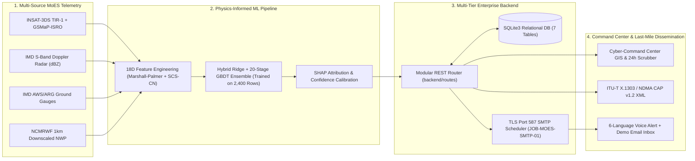
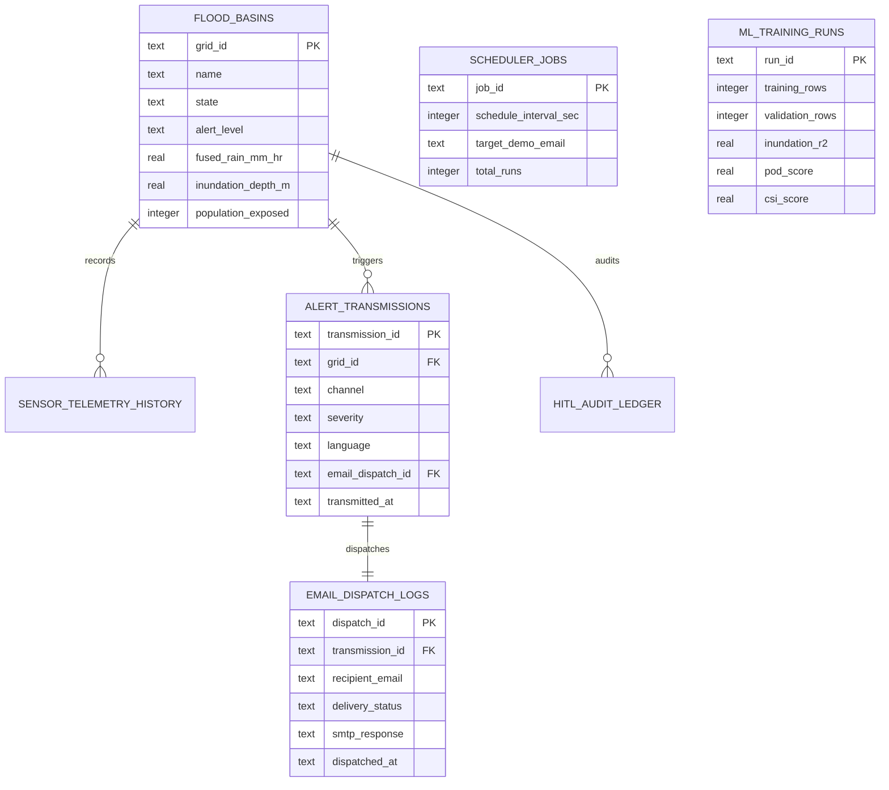

# 🏛️ RAINSHIELD-AI v6.0: System Architecture, Database ER Diagram & REST API Specification
**Problem Statement ID:** `SIH26071` | **Ministry of Earth Sciences (MoES)** | **Team:** `BWU INCURSION 1.0`

---

## 1. End-to-End Multi-Modal System Architecture

---

## 2. Relational Database Entity-Relationship Schema (`rainshield_moes.db`)

---

## 3. REST API Specification (`backend/routes/api_router.py`)

| Method | Endpoint | Controller | Description |
| :--- | :--- | :--- | :--- |
| `GET` | `/api/grids` | `GridController` | Returns all 6 `1km × 1km` flood basins from SQLite `flood_basins` |
| `GET` | `/api/backtests` | `GridController` | Returns 4 historical flood benchmark datasets (Michaung, Mumbai, Guwahati, Wayanad) |
| `GET` | `/api/simulate` | `GridController` | Computes real-time USDA/NRSC `SCS-CN` runoff $Q$ and 2D inundation depth |
| `POST` | `/api/alerts/transmit` | `AlertController` | Records alert transmission in SQLite and sends live `STARTTLS` email via `smtp.ethereal.email:587` |
| `GET` | `/api/alerts/emails` | `AlertController` | Returns provisioned Demo SMTP credentials, scheduler status, and recent email dispatch logs |
| `GET` | `/api/ml/overview` | `MLController` | Returns 2,400-row dataset preview, trained model metrics ($R^2, \text{POD}, \text{FAR}, \text{CSI}$), and DB counts |
| `POST` | `/api/ml/retrain` | `MLController` | Retrains the Hybrid Ridge + GBDT model on the 2,400-row training CSV and logs to SQLite |
| `POST` | `/api/scada` | `GridController` | Updates municipal SCADA pump RPM, sluice gate opening, and tidal backwater lock |
| `POST` | `/api/override` | `AlertController` | Logs SHA-256 Human-in-the-Loop authority override and dispatches SMTP confirmation |
| `GET` | `/api/cap/<grid_id>` | `AlertController` | Generates downloadable ITU-T X.1303 / NDMA SACHET `CAP v1.2` XML packet |
